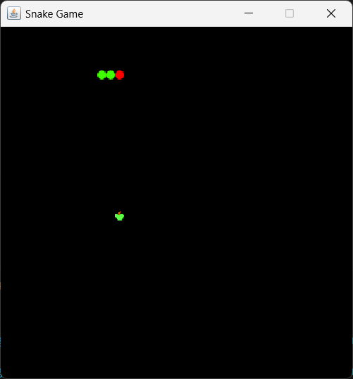
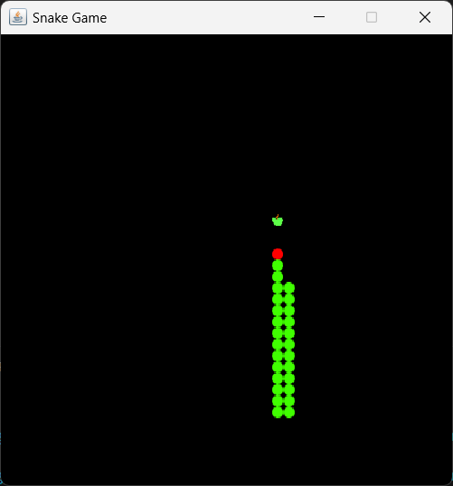
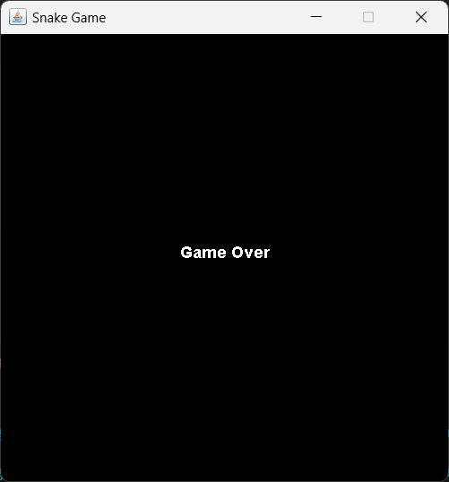

## Technologies
This project was made with the following core libraries:
- java.awt
    Provides classes for graphics, colors, fonts, and GUI elements.Used for rendering the game graphics and handling dimensions, fonts, and colors.
        1.Color
        2.Dimension
        3.Font
        4.FontMetrics
        5.Graphics
        6.Image
        7.Toolkit
- javax.swing
    Provides classes for building GUI applications in Java.Used for creating the game window and components.
        1.JFrame
        2.JPanel
        3.Timer
        4.ImageIcon
- java.awt.event
    Provides classes for handling events like key presses and timer actions.Used for game controls and timer-based movement.
        1.ActionEvent
        2.ActionListener
        3.KeyAdapter
        4.KeyEvent

## Folder Structure

The workspace contains two folders by default, where:

- `src`: the folder to maintain sources
- `lib`: the folder to maintain dependencies

Meanwhile, the compiled output files will be generated in the `bin` folder by default.

